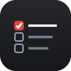
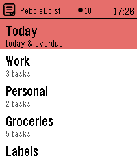
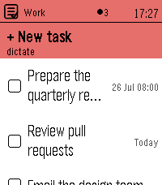
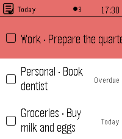
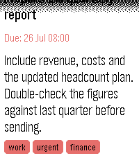
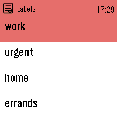
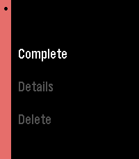

# PebbleDoist



**Your Todoist tasks on your wrist — add them by voice.**

PebbleDoist is a Pebble Time 2 watchapp for Todoist. Browse your tasks per list or
**by label**, see a **Today** view (today + overdue) with **due dates on every row**,
open a task's **details** (description + labels), **dictate new tasks** (with
natural-language due dates like "friday …"), and **complete or delete** them — straight
from the watch. Tasks with a deadline can also appear as **timeline pins**. Your API token
stays on the phone and is never sent to the watch.

> Available in **English, Nederlands, Français, Deutsch, Español**. By default it follows
> your watch's system language; you can also pick a fixed language in the phone settings.
> Screenshots below use English sample data.

## Screenshots

| Overview | List | Today |
|---|---|---|
|  |  |  |
| **Details** | **Labels** | **Actions** |
|  |  |  |

## What it does

- **Overview** — a **Today** row, the lists you selected (each with an open-task count), and a
  **Labels** row. The accent **top bar** shows the app icon, where you are, the number of open
  tasks and the time.
- **Today** — everything due today or overdue; items are prefixed with their list name
  (e.g. `Work · Review the quote`). Every task row shows its **due date** on the right.
- **Labels** — open **Labels** to browse your Todoist labels; pick one to see every task
  carrying it, across all your lists.
- **Details** — select a task → **Details** to read its full title, deadline, **description**
  and **labels** (shown as coloured badges).
- **Add by voice** — pick **+ New task**, dictate, and the phone posts it to Todoist.
  Natural-language dates are parsed (e.g. "…friday" sets a due date). Opened via Quick
  Launch → "Dictate right away", you dictate first and pick the target list afterward.
- **Complete / delete** — select a task to open its menu: **Complete** closes it in Todoist
  (instantly, no waiting), or **Delete** (with a confirmation) removes it.
- **Quick-complete** *(optional)* — turn it on in the phone settings and a single **Select**
  ticks a task off, with a short **Undo** window; long-press still opens the menu.
- **Text size** — set task lists to **Small**, **Medium** or **Large** in the phone settings;
  the rows grow with the text so more titles fit, or fewer but bigger ones do.
- **Timeline pins** *(optional)* — turn on **Show on timeline** in the phone settings and
  your tasks due in the next few days appear as pins on the Pebble timeline, each with a
  reminder that buzzes at the deadline. Completing, deleting or rescheduling a task clears
  or moves its pin automatically.

The Todoist API token lives **only on your phone** (Clay settings) and is never sent
to the watch.

## Setup

1. Get a Todoist API token: Todoist → **Settings → Integrations → Developer → API token**.
2. On the phone, open the app's settings (Clay). **First time is two steps** because the
   list of Todoist lists can only be fetched once a token is present:
   - Enter the **API token** and **save**.
   - Reopen settings → tick the **lists** to show on the watch, choose the **Quick Launch**
     start screen, optionally enable **Show on timeline**, and save again.

   **Language** and **text size** can be set at any point, with or without a token.
3. (Optional) Bind PebbleDoist to **Quick Launch** on the watch (Settings → Quick Launch)
   for a one-press "speak a task" flow.

## Build & run

```sh
pebble clean && pebble build          # clean is required after messageKeys/resource changes
pebble install --emulator emery       # emery emulator (dictation needs a real device)
pebble install --cloudpebble          # real PT2 via Dev Connect
```

The emulator's JS reaches the real internet, so with a real token you can test the
lists, add and complete in the emulator. **Dictation needs a real device** (the emulator
has no microphone), and **timeline pins need a real device** (they use your phone's
Pebble/Rebble account).

## Architecture

- `src/pkjs/index.js` — Todoist API v1 (Bearer auth): `GET /projects`, `GET /labels`,
  `GET /tasks` (per list, `today | overdue`, and `@label` filters), `GET /tasks/{id}` (details
  on demand), `POST /tasks` (with `due_string`), `POST /tasks/{id}/close`, `DELETE /tasks/{id}`.
  Fetches on the phone and streams only `id + title + due + done` to the watch, one message per
  ACK, so the inbox never overflows; a task's description + labels are fetched separately when
  its detail view opens. When enabled, it also pushes timeline pins to the Rebble timeline web
  API (`getTimelineToken` → `PUT`/`DELETE /v1/user/pins/{id}`), keyed by task id.
- `src/pkjs/i18n.js` — translations and the Clay settings page; the list checkboxes are
  generated at runtime from your live Todoist lists.
- `src/c/` — `data` (fixed arrays + the on-demand detail buffer), `config` (AppMessage
  inbox/outbox + persisted settings), `project_list` / `task_list` / `label_list` (MenuLayer +
  ActionMenu), `task_detail` (scrolling detail with description + label badges), `header_bar`
  (shared accent top bar: icon / title / open-task count / time), `dictation_flow` (voice
  capture), `cache` (persisted lists for instant paint), `i18n` (on-watch translations),
  `pebbledoist` (main; Quick-Launch gating via `launch_reason()`).

Store assets live in `marketing/` (`icon-80.png`, `icon-144.png`); the launcher menu
icon and marketing icons are generated by `tools/gen_icon.py` / `tools/gen_marketing.py`
(Pillow via a local `uv` venv).

## Possible follow-ups

See [`TODO.md`](TODO.md) for the roadmap (priority display + sort, on-watch reschedule,
richer Today, reopen recently-completed, and performance/size cleanups).
